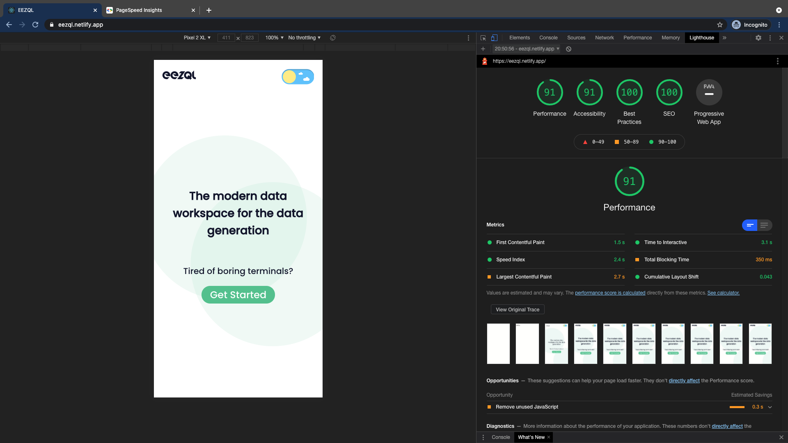
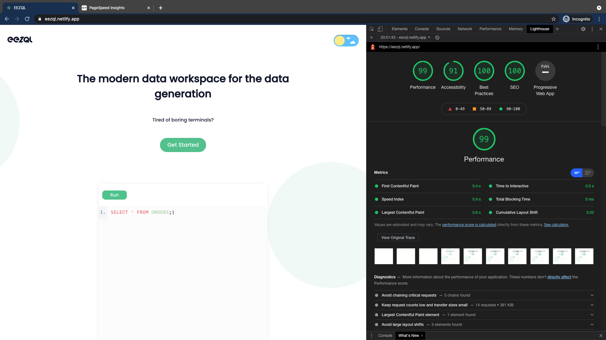

# Performance

---

### EEZQL

Framework used - ReactJS

## Features -

- Dark Mode / Light Mode
- Files are saved even after browser is closed.
- Fully Responsive in both Desktop and Mobile.

Lighthouse reports were obtained in incongonito mode to avoid cacheing.

### Page load time -

Desktop - 0.5s (Time to interactive)

Mobile - 3.1s (Time to interactive)

## Lighthouse reports

### Mobile

### Desktop

# Optimizations

- Used `lazy loading` to split javascript bundles.
- Converted `ttf/otf` to `woff` font type.
- Used online CDN to render images.

## Demo

Hosted on Netlify.

[Link](https://eezql.netlify.app/)
